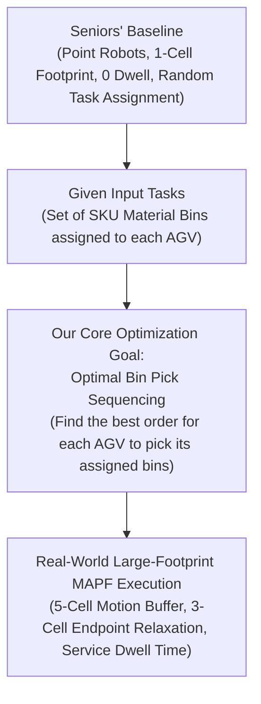
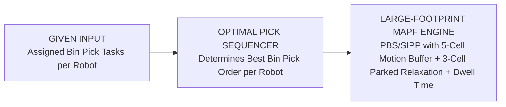

# Project Proposal & Problem Statement: Optimal Bin Pick Sequencing and Large-Footprint MAPF Execution

**Project Scope & Research Proposal**  
**Repository Baseline**: `MAPF-with-multi-level-architecture / RHCR-master`  

---

## 1. Baseline System & Where the Seniors Stopped

### 1.1 Inherited Baseline Overview
The inherited codebase (`C:\Users\raoni\Downloads\GitHub`) provides a foundational **Rolling-Horizon Collision Resolution (RHCR)** multi-agent path finding (MAPF) framework for automated warehouses.

### 1.2 Limitations of the Seniors' Baseline
While the baseline solves basic path planning, it relies on simplified abstractions that fail in physical automated warehouses:
1. **Ideal Point-Robot Abstraction (1-Cell Footprint)**: Robots are modeled as 1x1 point particles without physical length, rear/front body overhang, or rotation clearance.
2. **Zero Safety Gap**: Driving robots move back-to-back with 0 buffer space, creating severe collision risks for physical AGV deployments.
3. **Instant Task Completion (0 Dwell Time)**: Robots arriving at goal endpoints clear tasks instantly at timestep 0 without servicing the task.
4. **Random Task Assignment**: Goal locations are generated randomly without optimizing the sequence of bin-picking tasks for each robot.

---

## 2. Problem Statement & Core Objectives

### **Problem Title**: *Optimal Bin Pick Sequencing and Conflict-Free Large-Footprint MAPF Execution for Warehouse AGVs*

Starting from where the seniors stopped, we define our research problem with a clear, single-focused goal:

---

### 2.1 Given Inputs & Base Context
Drawing baseline context from modern warehouse bin-picking scenarios:
- **Given Inputs**: The customer orders and the required set of material bins/SKUs assigned to each robot are **given as input**.
- **No Complex Order Management Required**: We do not need to generate or solve complex order-wave scheduling from scratch; we treat the assigned bin-picking tasks for the robots as **pre-determined input data**.

---

### 2.2 Our Specific Optimization Goal: Optimal Bin Pick Sequencing
Given the set of required material bin locations assigned to a robot:
> **Core Challenge**: **In what optimal order/sequence should the robot pick and transport those bins?**

- **Objective**: Find an optimal picking sequence for each AGV that minimizes total travel distance, avoids bottleneck congestion in warehouse aisles, and reduces overall completion time (makespan).

---

### 2.3 Real-World Large-Footprint MAPF Execution Layer
Once the optimal bin-picking sequence for each robot is determined, the tasks are executed using our low-level **Large-Footprint MAPF Execution Engine**:

1. **5-Cell Dynamic Motion Safety Buffer**:
   - Moving AGVs ($t < t_{\text{goal}}$) reserve 5 consecutive grid cells (`[safety_back, physical_back, center, physical_front, safety_front]`).
   - Enforces a 1-cell physical safety gap behind and ahead of driving AGVs to prevent rear-end collisions.
2. **3-Cell Endpoint Relaxation**:
   - When an AGV reaches and parks at a bin picking location ($t \ge t_{\text{goal}}$), the 5-cell motion safety buffer is dynamically relaxed to a 3-cell physical body footprint (`[physical_back, center, physical_front]`).
   - Prevents parked robots from blocking adjacent travel aisles, allowing corridor traffic to flow freely without deadlocks.
3. **Task Service Dwell Time (`task_delay`)**:
   - Incorporates a service dwell period ($D$ timesteps) at each bin endpoint while the robot picks/services the item.
   - SIPP A* single-agent path search accounts for arrival release times (`arrival_t`) and holds 3-cell footprint reservations during servicing.

---

## 3. System Summary & Key Deliverables

1. **Bin Pick Sequencer**: An optimization module that takes the given bin tasks for each robot and computes the most efficient picking sequence.
2. **Conflict-Free Trajectory Execution**: Executes the sequenced bin-picking tasks using PBS/SIPP with 5-cell motion buffers, 3-cell parked relaxation, and task dwell time (`task_delay`), guaranteeing 100% collision-free navigation.
