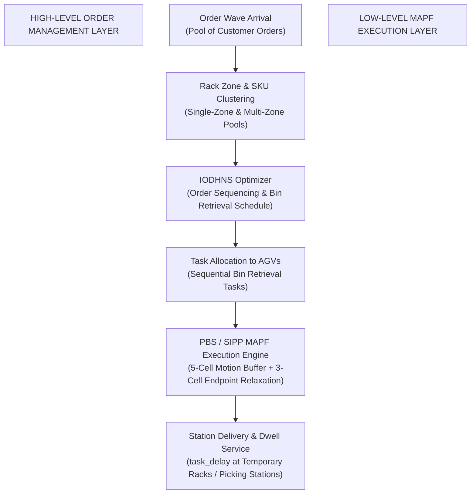

# Technical Report & Problem Statement: Multi-Agent Path Finding (MAPF) with Large Physical Footprints and Joint Order Sequencing in Separated Bin-Picking Systems

**Project Transition & Research Scope Document**  
**Repository**: `MAPF-with-multi-level-architecture / RHCR-master`  

---

## Executive Summary

This report documents the transition, enhancement, and strategic roadmap of our Multi-Agent Path Finding (MAPF) research project. 

We inherited a basic point-robot MAPF codebase from the senior project team, identified and resolved critical algorithmic bugs and performance bottlenecks, and upgraded the system to support **real-world physical robot geometry** (5-cell dynamic motion safety buffers, 3-cell endpoint relaxation, and task service dwell times). 

Moving forward, our next goal is to integrate a high-level **Order Sequencing and Temporary Rack Shelving Manager** based on recent research (*Zheng et al., IEEE T-ASE 2025*) into our large-footprint MAPF execution engine.

---

## Section 1: Baseline Project Review & Where Seniors Stopped

### 1.1 Scope of the Seniors' Baseline
The inherited codebase (`C:\Users\raoni\Downloads\GitHub`) was based on the standard **Rolling-Horizon Collision Resolution (RHCR)** framework for warehouse automation:
- **Point-Robot Model (1-Cell Footprint)**: Robots were abstracted as 1x1 point particles without physical length, orientation clearance, or front/rear body overhang.
- **Zero Safety Gap**: Driving robots moved back-to-back with 0 buffer space, creating high collision risks for physical AGV deployments.
- **Zero Dwell Time (Instant Task Handshake)**: Robots arriving at goal cells instantly cleared their tasks at timestep 0 without servicing the task.

### 1.2 Critical Bugs & Flaws Corrected in Baseline
Upon deep analysis and testing, we discovered several severe bugs in the seniors' code that caused simulation crashes, freeze stalls, and collision detection failures:

| # | Bug / Issue in Seniors' Code | Root Cause | System Impact | Our Fix |
|---|---|---|---|---|
| **1** | **`ct.erase` Constraint Erasure** | In `ReservationTable::updateSIT`, `ct.erase(it)` deleted hard constraints from `ct`. | Made `isConstrained()` blind to collisions; caused solver loops and silent collisions. | **Removed `ct.erase(it)`**, retaining hard constraints across all planning windows. |
| **2** | **Missing `prioritize_start` in `ReservationTable::copy()`** | `ReservationTable::copy()` omitted `prioritize_start` and `task_delay`. | `rt.prioritize_start` defaulted to `false`, causing SIPP to skip start nodes and stall early (e.g. timestep 35). | **Preserved `prioritize_start` and `task_delay`** across all table copy routines and `PBS::setRT()`. |
| **3** | **Unsafe Heuristic Map Lookups** | Used strict `G.heuristics.at(goal_loc)[curr]`. | Threw `std::out_of_range` exceptions and crashed whenever an endpoint lacked precomputed tables. | **Added dynamic lazy heuristic computation & Manhattan distance fallbacks** in `SingleAgentSolver.cpp`. |
| **4** | **50,000 Node SIPP Freeze Limit** | SIPP single-agent expansion limit was set to 50,000 nodes. | When a goal was blocked, SIPP burned 34+ seconds exploring 50,000 useless nodes, freezing the UI. | **Reduced node limit to 3,000 nodes**, eliminating 34-second freezes completely. |
| **5** | **Non-Deterministic Tie-Breaking** | `SIPPNode::compare_node` used `rand() % 2 == 0`. | Created non-reproducible paths and made debugging impossible. | **Replaced with deterministic g-val and conflict comparisons**. |

---

## Section 2: Work Done So Far (Real-World Large-Footprint MAPF System)

We transformed the baseline system into a **Real-World Compliant, Large-Footprint Lifelong MAPF System**:

```
[Moving AGV Footprint: 5 Cells] 
  [Safety Back] [Physical Rear] [CENTER] [Physical Front] [Safety Front]
                       |
                       v  (Arrives at Goal Endpoint)
[Parked AGV Footprint: 3 Cells - Safety Buffer Relaxed]
                [Physical Rear] [CENTER] [Physical Front]
```

### 2.1 5-Cell Dynamic Motion Safety Buffer
- Implemented `get_5cell_occupied_cells` in `BasicGraph.h`.
- Moving robots ($t < t_{\text{goal}}$) reserve 5 consecutive grid cells (`[safety_back, physical_back, center, physical_front, safety_front]`).
- Enforces a 1-cell physical safety gap between driving AGVs to prevent rear-end collisions.

### 2.2 3-Cell Endpoint Relaxation
- When an AGV reaches and parks at its goal endpoint ($t \ge t_{\text{goal}}$), the 5-cell motion safety buffer is dynamically relaxed to a 3-cell physical body footprint (`[physical_back, center, physical_front]`).
- This prevents parked robots from blocking adjacent travel aisles, allowing corridor traffic to flow freely without deadlocks.

### 2.3 Task Service Dwell Time (`task_delay`)
- Integrated `--task_delay D` CLI parameter across `driver.cpp`, `BasicSystem`, `ReservationTable`, `PBS`, and `SIPP`.
- **Node-Level Arrival Tracking**: Added `arrival_t` in `SIPPNode` and updated `SIPP::run` to instantly advance internal node timesteps to `req_release = max(release_time, arrival_t + task_delay)` within safe intervals.
- Servicing robots stay parked at goal endpoints for $D$ timesteps while keeping their 3-cell footprint reserved in `ct`.

### 2.4 Traffic-Jam Watchdog Fix (`congested()`)
- Updated `BasicSystem::congested()` in `BasicSystem.cpp` so that idle or servicing robots at goal endpoints are excluded from traffic jam checks (`goal_locations[k].empty() || path[timestep].location == goal_locations[k].front().first`).
- Prevents false simulation aborts for large dwell values (e.g. `task_delay` = 7, 10, 20+).

---

## Section 3: Problem Statement for the Next Phase

### **Title**: *Joint Order Sequencing and Material Bin Task Allocation for Large-Footprint Lifelong MAPF in Separated Bin-Picking Warehouses*



### 3.1 Problem Definition
In modern automated warehouses employing **Separated Bin-Picking Systems** (*Zheng et al., IEEE T-ASE 2025*):
1. **High Fixed Racks** store thousands of Stock Keeping Units (SKUs) inside divided **Rack Zones**.
2. **Tote-Carrying AGVs** retrieve individual material bins from high fixed racks and transport them to **Temporary Racks** located near human picking stations.
3. **Batch Customer Orders (Order Waves)** arrive continuously, requiring specific combinations of SKUs.

### 3.2 Research Objective
We aim to bridge the high-level **Separated Bin-Picking Order Fulfillment Model** with our low-level **Large-Footprint Lifelong MAPF Engine**:

1. **High-Level Order Sequencing & Bin Allocation**:
   - Given an incoming order wave, calculate Shared SKU Ratios ($ssr_{i,j}$) and Rack Zone Match Rates ($mr_{i,k}$).
   - Optimally allocate orders to picking stations, determine which material bins AGVs must retrieve, and **compute the exact sequence in which AGVs should pick and transport those bins** to temporary station racks.
2. **Low-Level Conflict-Free MAPF Execution**:
   - Dispatch the optimal bin retrieval tasks to our AGV fleet.
   - Execute conflict-free trajectories using our **PBS/SIPP MAPF engine**, guaranteeing **zero collisions**, **5-cell dynamic motion gap**, **3-cell endpoint relaxation**, and **task dwell service (`task_delay`)** at picking stations.

---

## Section 4: Roadmap & Implementation Steps

1. **Order & SKU Data Module**: Define order pool structures, SKU-to-rack-zone mappings, and temporary rack capacity parameters ($P$ slots).
2. **Order Sequencing Solver**: Implement Phase 1 (**IODH** - Interactive Order Driven Heuristic) and Phase 2 (**LNSCG** - Large Neighborhood Search + Greedy + Simulated Annealing) to output optimal bin dispatch sequences.
3. **MAPF Execution Bridge**: Wire the generated bin dispatch sequences directly into `KivaSystem` goal queues and simulate execution across 100+ timesteps.
