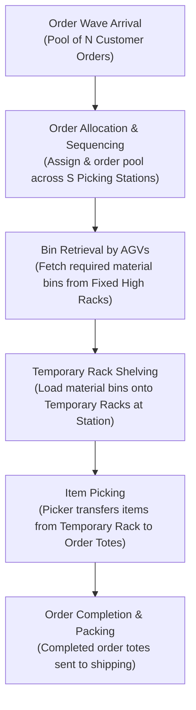
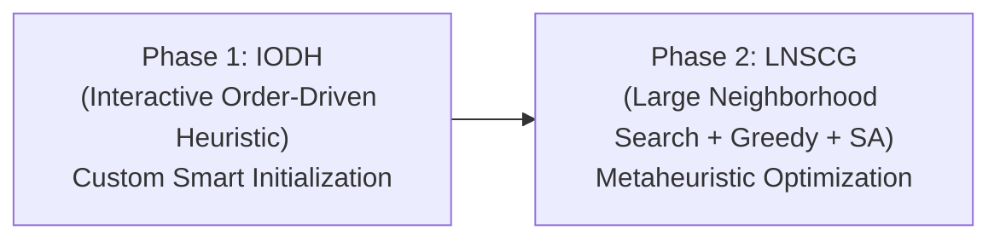

# Research Report: Joint Optimization of Order Sequencing and Temporary Rack Shelving for Separated Bin-Picking Systems

**Paper Reference**: *IEEE Transactions on Automation Science and Engineering (Vol. 22, 2025)*  
**Authors**: Zheng et al.  
**Topic**: Automated Warehouse Order Fulfillment & Optimization  

---

## 1. Problem Statement: What Are They Solving?

### 1.1 Background & Real-World Context
Modern e-commerce and distribution centers process tens of thousands of Stock Keeping Units (SKUs) and customer orders daily. Traditional **Robotic Mobile Fulfillment Systems (RMFS)**—such as Kiva-style warehouses—use Automated Guided Vehicles (AGVs) to carry entire multi-tiered mobile racks to human pickers at picking stations. 

While RMFS improves picking efficiency over manual walking, it suffers from two major real-world bottlenecks:
1. **Low Vertical Space Utilization**: Mobile racks are height-restricted (typically 2–3 meters) for safety and dynamic stability. Traditional warehouses, however, use fixed high-bay racks (up to 8+ meters). Converting an existing high-bay warehouse into an RMFS requires demolishing existing fixed racks, leading to massive capital expenditure, downtime, and wasted vertical space.
2. **Subpar AGV Transport Efficiency**: In an RMFS, if a customer order requires only 1 SKU from a 50-SKU mobile rack, an AGV must still move the *entire multi-ton rack*. This causes unnecessary battery drain, increased floor congestion, and poor transport utilization.

### 1.2 The System under Study: Separated Bin-Picking System
To overcome these limitations, leading logistics automation companies (e.g., Geek+, Hai Robotics) introduced the **Separated Bin-Picking System**:
- **Fixed High Racks** are retained to store goods at full vertical height (maximizing warehouse volume).
- **Tote-carrying AGVs / Autonomous Mobile Robots** retrieve only the specific **material bins/totes** needed from the fixed high racks.
- **Temporary Racks** placed adjacent to picking stations receive these material bins from AGVs.
- **Human Pickers** pick items directly from temporary racks into customer order totes.

```
[ Fixed High Racks (8m) ] ---> (Tote AGVs fetch Bins) ---> [ Temporary Racks at Station ] ---> (Picker) ---> [ Customer Orders ]
```

### 1.3 The MOTRSP Optimization Problem
The paper formulates the **Multiple Picking Station Order Sequencing and Temporary Rack Shelving Problem (MOTRSP)**.  
The core objective is to jointly determine:
1. **Order Allocation**: Which customer orders should be assigned to which picking station?
2. **Order Sequencing**: In what sequence should assigned orders be processed at each station?
3. **Temporary Rack Shelving & Exchange**: Which SKUs/bins should be loaded onto temporary racks, and when should temporary racks be updated?
4. **Workload Balancing**: How to ensure that picking stations have balanced workloads based on **actual SKU pick counts** (rather than just simple order counts).

---

## 2. System Architecture & Operational Workflow

The separated bin-picking system consists of three main subsystems: **Storage Subsystem**, **Picking Subsystem**, and **Packing Subsystem**.



### Detailed Operational Step-by-Step Flow:
1. **Wave Arrival**: Customer orders arrive in batch "waves" (an order pool of $N$ orders).
2. **Zone Division**: High fixed storage racks are divided into $K$ distinct **Rack Zones** based on warehouse geometry. Each SKU type is stored in a designated rack zone.
3. **Targeted Bin Retrieval**: When an order is scheduled at a picking station, AGVs enter the corresponding rack zone, pick up *only* the specific material bins containing the required SKUs, and transport them to the picking station.
4. **Temporary Rack Loading**: Bins are placed onto a **Temporary Rack** located right beside the picking station. Each temporary rack has a fixed slot capacity ($P$ bins).
5. **Item Fulfilling**: The human picker picks required quantities from the temporary rack into the active customer order totes sitting on the order buffer line.
6. **Order Dispatch & Rack Exchange**: Once all SKUs for an order are picked, the order moves to the packing area, and a new order fills the slot. When a temporary rack no longer matches the current active orders, an AGV exchanges it for new material bins.

---

## 3. Key Advantages & Practical Utility

| Feature | Traditional RMFS | Separated Bin-Picking System (This Paper) |
| :--- | :--- | :--- |
| **Warehouse Retrofitting** | High cost (requires demolishing 8m high racks) | **Very Low Cost** (retains existing fixed high racks) |
| **Storage Density** | Low (mobile racks capped at 2–3m height) | **Very High** (uses full 8m+ vertical warehouse space) |
| **AGV Transport Unit** | Entire heavy mobile rack (50+ SKUs) | **Single lightweight material bin** (only required SKU) |
| **Energy & Traffic** | High AGV battery consumption & congestion | **Low energy usage** & reduced floor congestion |
| **Workload Balancing** | Order-based (equal number of orders per station) | **SKU-based** (equal number of actual picking actions) |

---

## 4. Methodology & Algorithm: How Are They Solving It?

### 4.1 Computational Complexity
The authors prove that the MOTRSP mathematical model is **NP-hard** by reducing it to a generalized Set Covering Problem. Exact mathematical solvers (e.g., Gurobi, CPLEX) cannot solve real-world instances with thousands of orders within reasonable time limits.

### 4.2 Proposed Algorithm: IODHNS
To solve large-scale problems efficiently, the authors propose a two-stage algorithm named **IODHNS** (*Interactive Order-Driven Heuristic and Neighborhood Search*):



#### Phase 1: IODH (Interactive Order-Driven Heuristic)
- **Purpose**: Generates an initial high-quality solution.
- **Key Metrics**:
  - **Shared SKU Ratio ($ssr_{i,j}$)**: Measures SKU overlap between order $i$ and order $j$. Orders with high overlap are grouped together so one temporary rack can fulfill multiple orders simultaneously.
  - **Match Rate ($mr_{i,k}$)**: Measures how heavily order $i$ relies on rack zone $k$.
- **Pool Segmentation**:
  - Orders requiring only 1 rack zone are placed in **Single-Zone Pools** ($O[k]$).
  - Orders requiring multiple rack zones are placed in **Multi-Zone Pools** ($O[K+1]$).
- **Dynamic Interchange**: Dynamically alternates between updating active orders and updating temporary racks to ensure high temporary rack utilization.

#### Phase 2: LNSCG (Large Neighborhood Search Combining Greedy Algorithm)
- **Purpose**: Iteratively refines the initial solution to find global optimal schedules.
- **Components**:
  1. **Destroy & Repair Operators (LNS)**:
     - *Random Destroy / Single-Zone Destroy*: Removes a subset of orders from the current schedule.
     - *Random Repair / Initialization Repair*: Re-inserts destroyed orders back into stations using greedy rules while respecting workload balance.
  2. **Fast Greedy Evaluator**: Evaluates any order sequence candidate by determining the optimal temporary rack replacement schedule and counting total rack movements.
  3. **Simulated Annealing (SA) Acceptance Mechanism**: Accepts improved schedules immediately ($\Delta t < 0$) and accepts slightly worse schedules with probability $\exp(-\Delta t / \rho)$ to escape local minima.

---

## 5. Experimental Results & Key Insights

1. **Real-World Case Study**: Evaluated on operational data from a major auto-parts distribution center (thousands of SKUs and orders).
2. **Performance Improvement**: Outperformed standard warehouse dispatching rules (e.g., First-Come First-Served, Random Allocation) by significantly reducing total rack movements and AGV energy consumption.
3. **SKU Workload Balancing**: Demonstrated that SKU-based workload balancing prevents picker idle time and bottleneck stations compared to traditional order-count balancing.

---

## 6. Summary for Presentation / Talking Points

- **What problem is solved?** Jointly optimizing order assignment, order sequencing, temporary rack loading, and SKU workload balancing for separated bin-picking warehouses (**MOTRSP**).
- **Why is it important?** Allows existing high-bay warehouses to automate cheaply without tearing down 8m-high racks, carrying single material bins instead of heavy mobile racks.
- **What is the algorithm?** **IODHNS** = Similarity-driven smart initialization (**IODH**) + Metaheuristic neighborhood search (**LNS** + Greedy Evaluation + Simulated Annealing).
